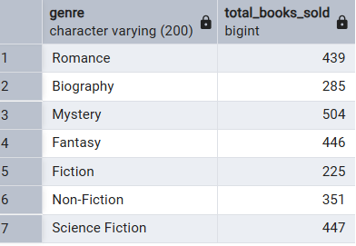
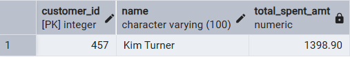
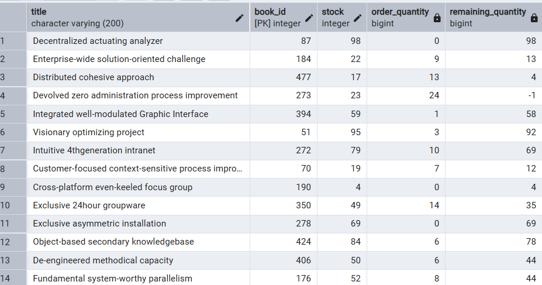

# Bookstore SQL Data Analysis

## Project Overview
This project analyzes a bookstore database using SQL to derive meaningful business insights. The dataset includes information about books, customers, and orders.

The objective of this project is to understand sales performance, customer behavior, and inventory management using SQL.

---

## Tools Used
- PostgreSQL

---

## Database Structure
The project consists of three main tables:

- **Books**: Contains book details such as title, author, genre, price, and stock  
- **Customers**: Contains customer information such as name, city, and country  
- **Orders**: Contains transaction data including order date, quantity, and total amount  

---

## SQL Concepts Used
- SELECT
- WHERE
- ORDER BY
- GROUP BY
- HAVING
- JOIN
- LEFT JOIN
- DISTINCT
- SUM
- AVG
- COUNT
- COALESCE
- LIMIT

---

## Key Business Questions
- What is the total revenue generated?
- Which genres have the highest sales?
- Who are the top customers based on spending?
- Which books are most expensive?
- How much stock remains after fulfilling orders?
- Which customers placed multiple orders?

---

## Sample Outputs

### Total Revenue

### Genre-wise Sales

### Top Customer

### Stock Remaining After Orders

### Most Expensive Book

---

## Key Insights
- The total revenue provides a clear understanding of overall business performance  
- Certain genres contribute significantly more to total sales compared to others  
- A small group of customers accounts for higher spending, indicating potential high-value customers  
- Stock analysis helps identify books that are running low and need restocking  
- Order patterns indicate repeat purchases, showing customer retention behavior  

---

## Dataset Source
This dataset was sourced from publicly available learning resources and is used for practice and portfolio purposes.

All SQL queries, analysis, and insights were independently performed by me.

---

## Conclusion
This project demonstrates my ability to work with relational databases, write efficient SQL queries, and extract actionable business insights from structured data.
